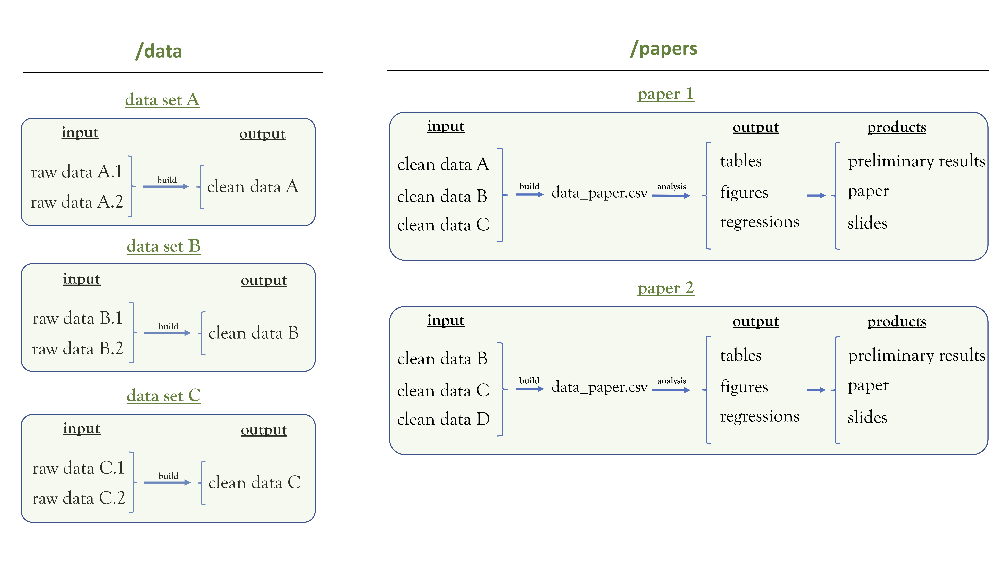

This folder provides an all-encompassing working structure for empirical papers.

It organizes every step of the process: merging and cleaning (several) data sets, performing analyses (tables, figures, regressions), writing the article itself and also presentations.

**To use it**: simply download it and adapt it to your own project!

## Summary
0. Workflow
1. Requirements
2. Folders
3. Files
4. Principles
5. Further Reading

## 0. Workflow

## 1. Requirements

This workflow requires:
- [Python 2](https://www.python.org) [Free] 
- [Bash](https://www.gnu.org/software/bash/) [Free]
- [Stata](https://www.stata.com) [Licensed]
- [LaTeX](https://www.latex-project.org) [Free]

Other great languages and softwares may also be used.
- [R](https://www.r-project.org) [Free]
- [Matlab](https://www.mathworks.com/products/matlab) [Licensed]
- [Python](https://www.python.org) [Free]

For now it's only adapted for OSX (Apple) environments. But feel free to adapt it to Windows (and please share it with me!).

## 2. Folders

##### `/code`
- Any code that manipulates build data and performs analysis should be put here.
- All output should be redirected into `/output`. Ideally as a single data file called, say, `data.dta`.
- Keep code clean and modularized.

  `/sub`
  - Holds modularized code to implement subroutines in `build.do` and `analysis.do`.
  
##### `/input`
- Any original data source should be included here in clean and normalized form.
- Only include cleaned files. Raw external files should be cleaned in each data source specific folder.
- These data sets will then be manipulated and merged by the files in `/code`.
  
##### `/output`
- Holds the final data set, to be then used in `/code/analysis.do`.
- Contains all analysis objects generated by files in `/code`.
- Will then serve as source for the generation of `.tex` files.
	
##### `/tmp`
- Contains any temporary file created during the manipulation of input data sets or the analysis routine.

##### `/extra`
- Contains any extra file relevant to the paper.
- Examples: grant material, previous analyses.

##### `/products`
- Where the juice is produced.
- Contains all files on preliminary results, the paper itself and presentations.

  `/sub`
  - Curated set of packages and shortcuts commonly used in Social Science papers and presentations.

## 3. Files

##### `run_paper.py`
- Automates the whole paper construction.
- Runs everything in a pre-specified order, from beginning (building data sets) to end (compiling `.tex` files).
- Keeps clear what should be run when.
- Also cleans `/output` and `/tmp` folders before running other code.

##### `/code/get_input.py`
- Erases any file inside `/input` and copies any original data set from outside sources.
- Ensures consistency across original data generation and data building for paper.

## 4. Principles

- For each new project, start (i) a structured versioned folder, (ii) a task manager project, and (iii) a set of slides.
	1. Copy this folder and use a version control system (e.g. [Git](https://git-scm.com/)).
		* Keep track of multiple authors' edits.
		* No more `report_final_v3.2b_ST_toDelete.tex`.
		* Use branching to work simultaneously on the same code.
	2. Start a project within a task manager. (see [2Do](https://www.2doapp.com/), [Asana](https://asana.com), [Trello](https://trello.com/), [JIRA](https://www.atlassian.com/software/jira), etc).
		* Your email inbox is not a task manager.
		* Tasks should be actionable atoms.
		* Set priorities, assignments, due dates, etc.
		* Only one person should be ultimately responsible for each task.
		* Do regular reviews and cleaning.
	3. Slides
		* Containing the current (summarized) version of the paper.
		* Update it continuously. It will discipline your work.
- Keep two folders: `/papers`, and `/data`, as shown in the workflow.
	1. Data.
		* Each folder within `/data` is a data set.
		* Use the same structure for cleaning these datasets (`/input`, `/code`, `/output`, `/tmp`)
	2. Papers.
		* Each folder within `/papers` is paper.
		* Use `/main_paper/code/get_input.py` to copy original datasets.
- Use a good text editor (I recommend [vim](http://www.vim.org/), [Sublime Text](https://www.sublimetext.com/) or [Notepad ++](https://notepad-plus-plus.org/)).
- Use a modern and flexible communication tool (see [Slack](https://slack.com)).
- Use a good reference/citation manager (I recommend [Mendeley](https://www.mendeley.com)). Let Mendeley (1) watch a downloads folder, (2) automatically organize every paper into a separate maintained folder in the cloud (Dropbox, Google Drive, etc.), and (3) keep a .bib file with all formatted citations in a `/references` folder. Let each paper be named "Author - Year - Title" (so you can search for PDFs efficiently). If you have a tablet to read and annotate papers, sync your reader (I recommend [PDF Expert](https://pdfexpert.com/)) to this folder. This way, all your annotations will automatically remain synced with Mendeley.
- Keep documentation lean and clean.
- Keep this folder organized. Your future self thanks your present effort.

## 5. Further Reading

- [Gentzkow & Shapiro (2014) Code and Data for the Social Sciences](https://web.stanford.edu/~gentzkow/research/CodeAndData.pdf)
- [Julian Reif's Stata Coding Guide](https://reifjulian.github.io/guide)
- [Michael Stepner's Coding Style Guide](https://github.com/michaelstepner/healthinequality-code/blob/master/code/readme.md)
- [Gentzkow & Shapiro Lab's Paper Template](https://github.com/gslab-econ/template)
- [Tutorial on how to combine Git and Dropbox](https://github.com/kbjarkefur/GitHubDropBox)
- [Guidelines on how to name git commits](https://www.conventionalcommits.org)
